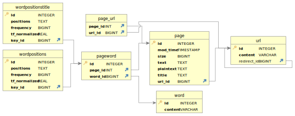

# Overall design of the System
The search engine is written in Python. Building the source code produces a website...................................................................................
# File structures used in index database


## General Principles

For precise communication, we would need consistent names. We used these two names consistently:

* `rowid` indicates the integer ID of an item. It is the primary key of each table so cannot be null.
* `content` is the item

For example, in the URL-to-ID table, `rowid` is the URL ID, and `content` is the URL.

## URL-to-ID table `main.urls`

### Fields

Field name | Type | Can be null? | Indexed for efficient search? | Description
-----------|------|--------------|----------|-------------
rowid      | Integer (Primary key) | No | Yes (Automatic for primary key, for searching URL) | URL ID of each unique URL
content    | Text | No | Yes (for searching URL ID) | Unique URL
redirect_id | Integer (Foreign key - another URL ID) | Yes (Default value) | No | the URL redirected to by this page (unused for now)

## Word-to-ID table `main.words`

### Fields

Field name | Type | Can be null? | Indexed for efficient search? | Description
-----------|------|--------------|----------|-------------
rowid      | Integer (Primary key) | No | Yes (Automatic for primary key, for searching Word) | Word ID of each unique Word
content    | Text | No | Yes (for searching Word ID) | Unique Word

## Page information table `main.pages`

### Fields

Field name | Type | Can be null? | Indexed for efficient search? | Description
-----------|------|--------------|----------|-------------
rowid      | Integer (Primary key and Foreign key - URL ID) | No | Yes (Automatic for primary key - for searching page information) | URL ID of the page
mod_time   | Integer | No | No | UNIX timestamp in seconds: Last modified time in HTTP header if available, or the time of scraping otherwise.
size   | Integer | No | No | Size in bytes: Size of page in HTTP header if available, or the size of plain text (without HTML tags) otherwise. Must be greater than or equal to 0.
text   | Text | No | No | Complete page with HTML tags
plaintext   | Text | No | No | Plain human-readable text without HTML tags
title   | Text | No | No | Title of the page
links   | Text | No | No | Sorted JSON list of unique URL IDs linked by this page. It is simpler on the application side not to create a whole new table just for storing links, but this also means complications on the database side. Specifically, we use triggers as seen below.

### Triggers for links

Since we did not use a table for storing links, we need to use triggers manually ensure data validity instead of just using `ON UPDATE CASCADE ON DELETE RESTRICT` which would only update database-known primary keys - foreign key pairs instead of also updating our links.

For the equivalent of `ON UPDATE CASCADE`, when a `rowid` updates, we would replace any references to the old `rowid` inside the `links` column with the new one.

For the equivalent of `ON DELETE RESTRICT`, when a `rowid` is about to be deleted, we check for any references to this `rowid` inside the `links` column, and abort with error if found.

When we insert or update `links` values, we:

1. Check that it is valid JSON
2. Check that all elements are integers
3. Check that there are no duplicate values
4. Check that it is a sorted list
5. Check that each element is a valid URL ID

## Word occurrences for each page `main.word_occurrences` & `main.word_occurrences_title`

> `main.word_occurrences_title` is used for storing word occurrences in the title.
> `main.word_occurrences` is used for storing word occurrences outside of the title.

Field name | Type | Can be null? | Indexed for efficient search? | Description
-----------|------|--------------|----------|-------------
page_id      | Integer (Composite Primary key and Foreign key - URL ID) | No | Yes (Automatic for primary key - for searching positions and frequencies) | URL ID of the page
word_id   | Integer (Composite Primary key and Foreign key - Word ID) | No | Yes (Automatic for primary key - for searching positions and frequencies) | Word ID of the word
positions   | Text | No | No | Sorted JSON list of unique nonnegative word positions. Again, using JSON instead of another table simplifies application side but complicates database side. Specifically, we use triggers as seen below.
frequency   | Integer | No | No | Computed frequency of the word in question in the page. Since lookup occurs much more frequently than scraping, this enables faster lookup, trading for a slower scraping.

### Triggers for positions

Since `positions` store multiple word positions per row using JSON lists, we need to enforce validity manually. When a `position` value is inserted or deleted, we:

1. Check that it is valid JSON
2. Check that all elements are integers
3. Check that there are no duplicate values
4. Check that there are no negative values
5. Check that it is a sorted list

# Algorithms used

## Crawler - Breadth First Search
The first part of the search engine is the crawler. Upon initiation of the crawler, a `ConcurrentCrawler` defined in `src/egod_search/crawl/concurrency.py` is created. When `show_progress` is `true` (no `--no-progress`): If `summary_path` (`-s` argument) is provided, then two progress bars for crawling and summary writing are presented; otherwise one progress bar for crawling is shown. This is defined in `src/egod_search/crawl/main.py`. 

When each page is crawled, the `Crawler.crawl` method in `src/egod_search/crawl/__init__.py` is called. The HTTP response and content type of the page are validated, then we detect the character set to guard against non-UTF8 web pages. All `<a>` HTML tags that contain `http://` or `https://` outlinks are then extracted. 

The main algorithm for deciding which pages to crawl is the Breadth First Search in `ConcurrentCrawler.run` of `src/egod_search/crawl/concurrency.py`. From the first requested page, we enqueue all outlinks, then crawl each dequeued page, with all outlinks enqueued. This is done until `page_count` (`-n` argument) is reached. Each crawled page is stored as in-memory objects of class `UnindexedPage` defined at `src/egod_search/index/__init__.py` and saved to the database sequentially with locking since SQLite does not support concurrent writing. Most of the code in the crawler relate to concurrency to speed up crawling. 

## Indexer

The indexer is a converter from `UnindexedPage` to `IndexedPage`, implemented as the `index_page` function of `src/egod_search/index/__init__.py`. First, 

## Retrieval function

............................................................................................

## Web Interface

............................................................................................

# Installation procedure

## Step 1

Set up a Python environment: Ensure that you have at least Python >= 3.11 installed on your system. You can download the latest version of Python from the official Python website (<https://www.python.org>) and follow the installation instructions for your operating system.

_Note: For Windows, you may want to install the Python launcher, enabling you to use `py` in place of `python` for consistently running the latest version of Python, avoiding any conflicts with third-party software and outdated Python versions._

_**After doing so, replace all instances of `python` with `py` in the following commands.**_

## Step 2

Unzip the submission file and navigate to the extracted folder.

Then, open a terminal at the folder.

## Step 3

**Create a virtual environment (highly recommended): Given how other teams may also use Python, and the dependencies used between projects may have conflicts, it is highly recommended to create a virtual environment for running our project.** To create a virtual environment, run the following command:

```shell
python -m venv venv
```

This command creates a new virtual environment named "venv" in the "comp-4321" directory.

The virtual environment can effectively avoid issues such as:
_ERROR: pip's dependency resolver does not currently take into account all the packages that are installed. This behaviour is the source of the following dependency conflicts.
fastapi 0.104.1 requires anyio<4.0.0,>=3.7.1, but you have anyio 4.3.0 which is incompatible._

## Step 4

Activate the virtual environment: Activate the virtual environment using the appropriate command based on your operating system:

On Windows:

```shell
venv\Scripts\activate
```

On Linux or macOS:

```shell
source venv/bin/activate
```

## Step 5

Install the required packages: In the root directory of the project (i.e., the "comp-4321" directory), there should be a file named "requirements.txt". To install the required packages, run the following command:

_Note: Check again to see if `(venv)` appears in the command prompt for using the virtual environment._

```shell
pip install -r requirements.txt
```

This command will install all the necessary packages specified in the "requirements.txt" file.

## Step 6

Run the crawler using the command for Phase 1.

_Note: Check again to see if `(venv)` appears in the command prompt for using the virtual environment._

```shell
python -m egod_search.crawl -n 30 -d database.db -s spider_result.txt https://www.cse.ust.hk/~kwtleung/COMP4321/testpage.htm
```

In case of re-run, and the database needs to be cleared, use the appropriate command based on your operating system:

On Windows:

```shell
del database.db
```

On Linux or macOS:

```shell
rm database.db
```

## Important notices

The program says it is `Finished` but does not end, just gets stuck:
On Windows, after the program has finished, the CLI may freeze if the program finishes too quickly. This is a [CPython bug](https://github.com/python/cpython/issues/111604) and is out of our control. Just Ctrl+C to get out of it and ignore the errors as they are harmless.  

If there is an error mentioning `requires a different Python`, for example `ERROR: Package 'egod-search' requires a different Python: 3.10.11 not in '>=3.11.0'`:
Your Python version is outdated and does not support [features the code relies on](https://stackoverflow.com/a/77247460). Please go to <https://www.python.org/downloads/> and download the newest version of Python.

## FAQ

Q: Install does not work

A1: Check again that `(venv)` appears in the command prompt for using the virtual environment. The virtual environment is not entered by default.

Q: `venv\Scripts\activate` does not work for my Windows machine

A: For Windows machines with MinGW-w64, `python.exe` may refer to the MinGW-w64 executable. It does not work because it generates Linux version of virtual environment script, and likely does not come with Python >= 3.11. Use `py` which can guarantee running the Windows Python executable.

## Tested working platforms

Linux: Debian 12 on Python 3.11.2 (older Linux distros do not have >= Python 3.11, either install yourself or switch machines)
Windows: Windows 10 and 11, Python 3.11.2 and 3.12.2

# Highlight of features beyond the required specification

# Testing of the functions implemented; include screenshots if applicable in the report

## Crawler

The testing of crawler is located in `src/egod_search/crawl/test___init__.py`, `src/egod_search/crawl/test_concurrency.py` and `src/egod_search/crawl/test_main.py`. You run it via................................................................

## Indexer

............................................................................................

## Retrieval function

............................................................................................

## Web Interface

............................................................................................

# Conclusion: What are the strengths and weaknesses of your systems; what you would have done differently if you could re-implement the whole system; what would be the interesting features to add to your system, etc

............................................................................................

# Contribution

............................................................................................