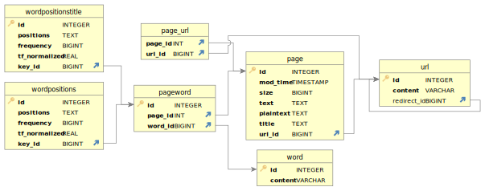

# COMP4321 Phase 1 – Database Design Report <!-- markdownlint-disable MD024 -->

## General Principles

For precise communication, we would need consistent names. We used these two names consistently:

* `rowid` indicates the integer ID of an item. It is the primary key of each table so cannot be null.
* `content` is the item

For example, in the URL-to-ID table, `rowid` is the URL ID, and `content` is the URL.

## URL-to-ID table `main.urls`

### Fields

Field name | Type | Can be null? | Indexed for efficient search? | Description
-----------|------|--------------|----------|-------------
rowid      | Integer (Primary key) | No | Yes (Automatic for primary key, for searching URL) | URL ID of each unique URL
content    | Text | No | Yes (for searching URL ID) | Unique URL
redirect_id | Integer (Foreign key - another URL ID) | Yes (Default value) | No | the URL redirected to by this page (unused for now)

## Word-to-ID table `main.words`

### Fields

Field name | Type | Can be null? | Indexed for efficient search? | Description
-----------|------|--------------|----------|-------------
rowid      | Integer (Primary key) | No | Yes (Automatic for primary key, for searching Word) | Word ID of each unique Word
content    | Text | No | Yes (for searching Word ID) | Unique Word

## Page information table `main.pages`

### Fields

Field name | Type | Can be null? | Indexed for efficient search? | Description
-----------|------|--------------|----------|-------------
rowid      | Integer (Primary key and Foreign key - URL ID) | No | Yes (Automatic for primary key - for searching page information) | URL ID of the page
mod_time   | Integer | No | No | UNIX timestamp in seconds: Last modified time in HTTP header if available, or the time of scraping otherwise.
size   | Integer | No | No | Size in bytes: Size of page in HTTP header if available, or the size of plain text (without HTML tags) otherwise. Must be greater than or equal to 0.
text   | Text | No | No | Complete page with HTML tags
plaintext   | Text | No | No | Plain human-readable text without HTML tags
title   | Text | No | No | Title of the page
links   | Text | No | No | Sorted JSON list of unique URL IDs linked by this page. It is simpler on the application side not to create a whole new table just for storing links, but this also means complications on the database side. Specifically, we use triggers as seen below.

### Triggers for links

Since we did not use a table for storing links, we need to use triggers manually ensure data validity instead of just using `ON UPDATE CASCADE ON DELETE RESTRICT` which would only update database-known primary keys - foreign key pairs instead of also updating our links.

For the equivalent of `ON UPDATE CASCADE`, when a `rowid` updates, we would replace any references to the old `rowid` inside the `links` column with the new one.

For the equivalent of `ON DELETE RESTRICT`, when a `rowid` is about to be deleted, we check for any references to this `rowid` inside the `links` column, and abort with error if found.

When we insert or update `links` values, we:

1. Check that it is valid JSON
2. Check that all elements are integers
3. Check that there are no duplicate values
4. Check that it is a sorted list
5. Check that each element is a valid URL ID

## Word occurrences for each page `main.word_occurrences` & `main.word_occurrences_title`

> `main.word_occurrences_title` is used for storing word occurrences in the title.
> `main.word_occurrences` is used for storing word occurrences outside of the title.

Field name | Type | Can be null? | Indexed for efficient search? | Description
-----------|------|--------------|----------|-------------
page_id      | Integer (Composite Primary key and Foreign key - URL ID) | No | Yes (Automatic for primary key - for searching positions and frequencies) | URL ID of the page
word_id   | Integer (Composite Primary key and Foreign key - Word ID) | No | Yes (Automatic for primary key - for searching positions and frequencies) | Word ID of the word
positions   | Text | No | No | Sorted JSON list of unique nonnegative word positions. Again, using JSON instead of another table simplifies application side but complicates database side. Specifically, we use triggers as seen below.
frequency   | Integer | No | No | Computed frequency of the word in question in the page. Since lookup occurs much more frequently than scraping, this enables faster lookup, trading for a slower scraping.

### Triggers for positions

Since `positions` store multiple word positions per row using JSON lists, we need to enforce validity manually. When a `position` value is inserted or deleted, we:

1. Check that it is valid JSON
2. Check that all elements are integers
3. Check that there are no duplicate values
4. Check that there are no negative values
5. Check that it is a sorted list
